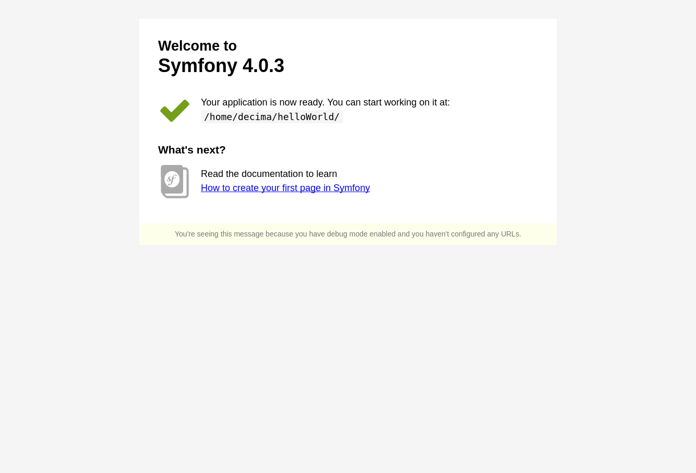
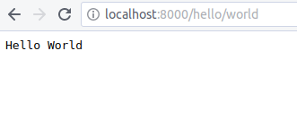
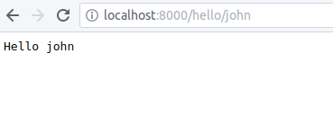

# Symfony Step By Step Tutorial

This repository is linked to [this course (in progress)](https://docs.google.com/presentation/d/1ZhjHsnr5ItrDmTUCDQmkaJ3nl1ZQcc6hFhSYKhpo0wE/edit?usp=sharing "presentation"). 
Feel free to contribute.

## requirements

- PHP 7.1
- [composer - PHP dependencies management](https://getcomposer.org/)


## Steps

Each end of steps are linked to a symfony tag. You can checkout the tag you want using:
```bash
$ git fetch --all --tags --prune
$ git checkout tags/step_xxx
$ composer update

```

Where xxx stands for the number of the step.


### Part 1 - Hello World

#### step 101 - installing the project

Install composer if it's not already done.
```bash
$ curl -sS https://getcomposer.org/installer | php
$ sudo mv composer.phar /usr/local/bin/composer
$ sudo chmod a+x /usr/local/bin/composer
```

Now that composer is installed, you can create your project

```bash
$ composer create-project symfony/skeleton helloWorld
$ cd helloWorld
```

_optional_ if you don't want to install the symfony server, just start,
```bash
$ php -S 127.0.0.1:8000 -t public
```

otherwise install the dev server

```bash
$ composer require server --dev
```
and then start the server using

```bash
$ bin/console server:run
```


Now go to [http://localhost:8000](http://localhost:8000), if everything is cool you should see: 





**From now, don't forget to start the server**
 
#### step 102 - First page

First, you have to create your first Controller. 

Create a class named `App\Controller\HelloWorldController` in `/src/Controller/HelloWorldController.php` extending 
`Symfony\Bundle\FrameworkBundle\Controller\Controller`.

In this class, add a method called `hello`. this method will return a new `Symfony\Component\HttpFoundation\Response` 
object with a string as first argument of the object. 

Your class should look like:
```php
<?php
namespace App\Controller;


use Symfony\Bundle\FrameworkBundle\Controller\Controller;
use Symfony\Component\HttpFoundation\Response;

class HelloWorldController extends Controller
{

    public function hello()
    {
        $name = "World";

        return new Response(
            "<html><body>Hello " . $name . "</body></html>"
        );
    }

}
```
Then, in `config/routes.yaml` add the following lines 

```yaml
# the "app_hello_world" route name is not important yet
app_hello_world:
    path: /hello/world
    controller: App\Controller\HelloWorldController::hello
```

Now go to [http://localhost:8000/hello/world](http://localhost:8000/hello/world) and if everything is good,
you will see: 


#### Step 103 - Routing

For this step, we will not explain how to manage routing with yaml notations.

First, you will need annotations package.
```bash
$ composer require annotations
```

Now, in routes.yaml, you can remove your config and add in your controller class some annotations :
```php
<?php
namespace App\Controller;

use Symfony\Bundle\FrameworkBundle\Controller\Controller;
use Symfony\Component\HttpFoundation\Response;
use Symfony\Component\Routing\Annotation\Route; //add this line to add usage of Route class.

class HelloWorldController extends Controller
{

    /**
     * @Route("/hello/{name}", name="app_hello") //add this comment to annotations
     */
    public function hello($name="World")
    {

        return new Response(
            "<html><body>Hello " . $name . "</body></html>"
        );
    }

}

```

When you go back to [http://localhost:8000/hello/world](http://localhost:8000/hello/world) nothing has changed,
so the changes work.

And more, if you go to [http://localhost:8000/hello/john](http://localhost:8000/hello/john) you will see:



-------------------------------------------------------------------
#### Step 103.5 - Other controller
**Before next step, You have to create another controller**

The name of the controller should be MainController and implement a method named homeAction pointing on route / 
and named app_home.
This is the content to return.
```html
<!doctype html>
<html>
    <body>
        <h1>Welcome to my website.</h1>
    </body>
</html>
```

#### Step 104 - Twig - Templating
> A template is simply a text file that can generate any text-based format (HTML, XML, CSV, LaTeX ...).
>
>The most familiar type of template is a PHP template - a text file parsed by PHP that contains a mix of text
 and PHP code.
 
Symfony use its own templating language named twig. Next is the difference between a PHP template, and a TWIG template.

```php
<!DOCTYPE html>
<html>
    <head>
        <title>PHP Page</title>
    </head>
    <body>
        <h1><?php echo $page_title ?></h1>

        <table>
            <?php foreach ($items as $key=>$item): ?>
                <tr>
                    <td>
                        <?php echo $key + 1; ?>
                    </td>
                    <td>
                        <?php echo $item; ?>
                    </td>
                </tr>
            <?php endforeach ?>
        </table>
    </body>
</html>

```
is more like:
```twig
<!DOCTYPE html>
<html>
    <head>
        <title>Twig Page</title>
    </head>
    <body>
        <h1>{{ page_title }}</h1>
        <table>
            
                <tr>
                    <td>
                        {{ loop.index }}
                    </td>
                    <td>
                        {{ item }}
                    </td>
                </tr>
            
        </table>
    </body>
</html>
```

To enable Twig support in our project, first add the needed composer package.

```bash
$ composer require twig
```

A `templates` folder has been created with only one file named `base.html.twig`. Let's first have a look at the 
structure of this file.
```twig
<!DOCTYPE html>
<html>
    <head>
        <meta charset="UTF-8">
        <title>Welcome!</title>
        
    </head>
    <body>
        
        
    </body>
</html>
```
This template has 4 calls to a *twig function* block. This is one of the main functions in templating.
Their main purpose is to be replaced with other content from sub templates included using extends function.
Without removing this code, we will add a footer between block body and block javascripts. 
```twig
...
        
        <footer>
            <hr/>
            &copy; YourName
        </footer>
        
...
```

Next we will create a new template `templates\main\home.html.twig`. 
```twig


    <h1>Welcome to {{ project_name|upper }}.</h1>

```

Then modify your homeAction from MainController to look like this : 
```php
...
 /**
  * @Route("/", name="app_home")
  */
 public function homeAction()
    {
        return $this->render("main/home.html.twig", ["project_name" => "yourProject"]);
        
    }
...
```

or if you want less code in your action method, you can do it as :
```php
...
use Sensio\Bundle\FrameworkExtraBundle\Configuration\Template;
...
 
 
    /**
     * @Route("/", name="app_home")
     * @Template("main/home.html.twig")
     */
    public function homeAction()
    {
        return ["project_name" => "yourProject"];
    }

```
Now go to [localhost:8000](http://localhost:8000/) and you can see your project name and the footer previously added.

With the help of extend you have extended the base template and replaced the body block. 

More details on what you can do with twig can be find on [the documentation](https://twig.symfony.com/doc/2.x/)


#### Step 104.5 - Other template
Now your turn. First add a menu to switch between pages using the twig "path function" and then add a template for 
helloAction in HelloWorldController.